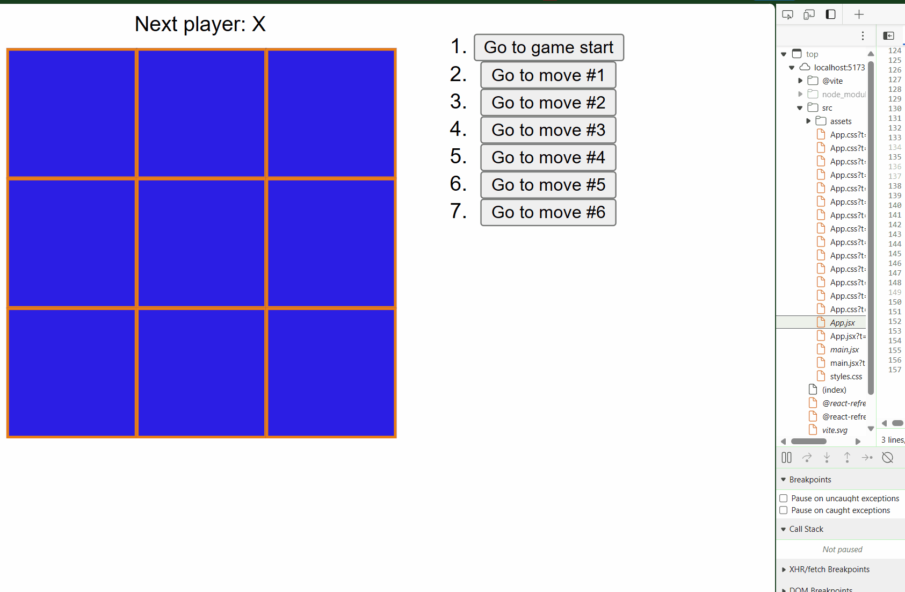

# TicTacToeReacJS
This is a tic-tac-toe game that touches on React concepts such as elements,
components, props, and state.

The game indicates when the user has won the game, stores game progress, and allow 
users to review the history and see previous versions of the game.
Demo here: 

